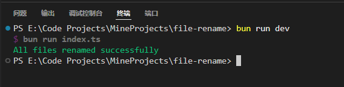

# xinz-file-rename
一个用于批量重命名文件的命令行工具。它可以帮助你快速、高效地重命名大量文件。

## 技术栈
- Bun
- Typescript

## 背景
通过电脑局域网搭建的家庭影院，在网络上下载的视频文件，通常以1.mp4，2.mp4，3.mp4等命名，当在电视上当贝播放器导入影片后，会存在多个同名的视频文件无法区分，所以考虑使用一级目录名称加递增序号的方式重命名后，可以方便进行视频查找观看。

## 功能特点
- 支持将target目录下的文件重命名为指定格式(一级目录名称+递增1开始的序号)。
- 支持多个目录

## 启动
```
bun install
bun run dev
```

## 效果
待处理前：


处理后：


终端运行结果：



